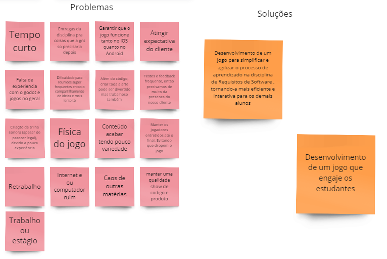
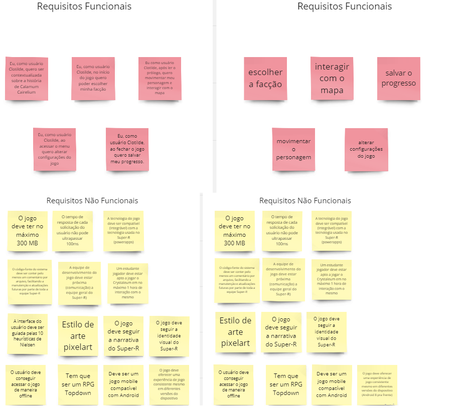
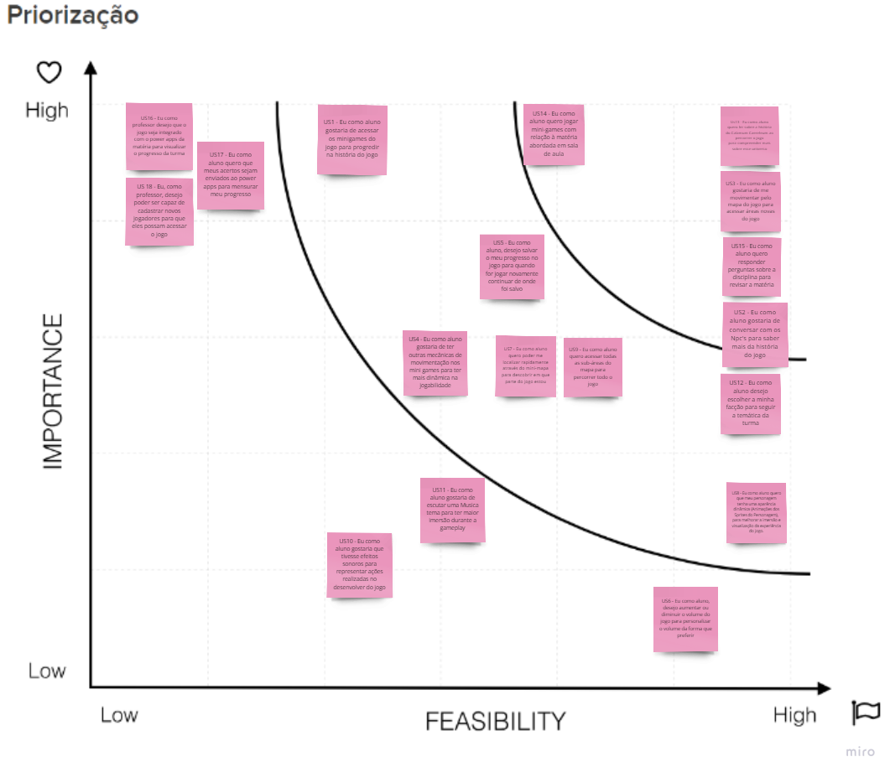
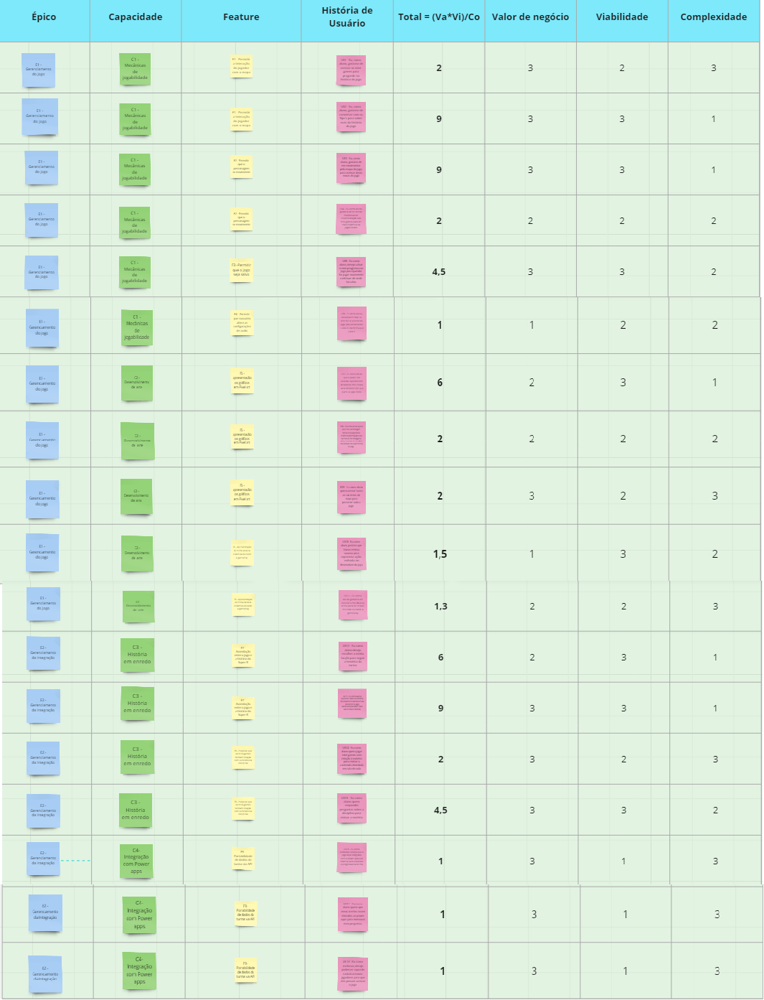
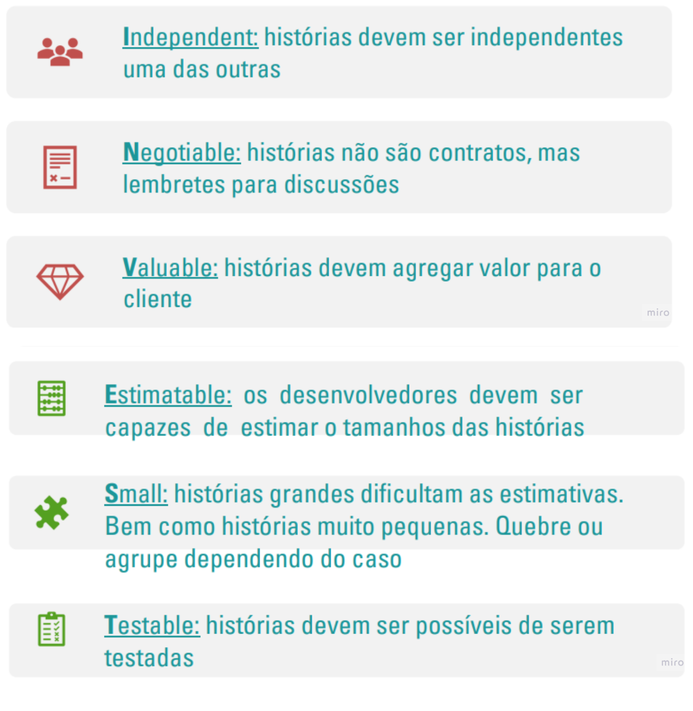
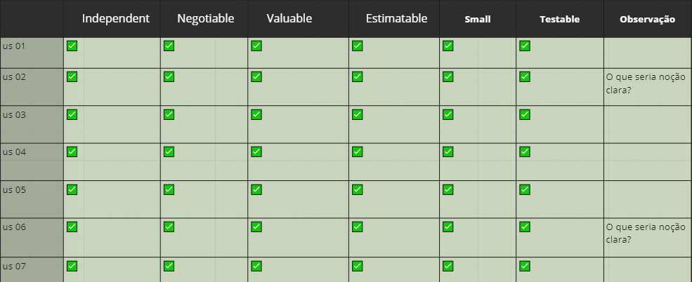
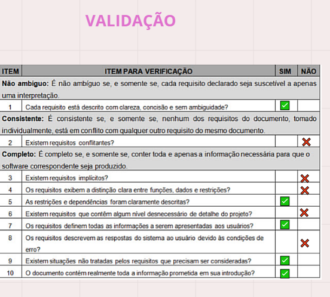
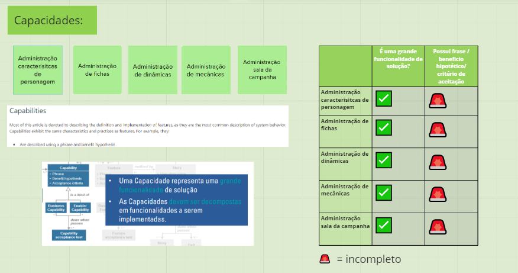

# Atividades e Técnicas de Engenharia de Requisitos

## Introdução

As atividades e técnicas de Engenharia de Requisitos desempenham uma função essencial no desenvolvimento e na construção de um Software que busca atender as necessiades de seus Stakewolders.

Desta forma, temos as seguintes atividades de ER:
- Elicitação e Descoberta
- Análise e Consenso
- Declaração
- Verificação e Validação
- Representação
- Organização e Atualização

### Elicitação e Descoberta
Regularmente sendo tida como um dos primeiros passos no processo de Engenharia de Requisitos, a partir dela podemos identificar uma fonte de informação (Documento, Stakeholders, etc..), visando escolher a técnica mais apropriada para aquele contexto. Além disso, apartir dessa técnica, podemos descobrir e extrair algo que previamente não era conhecido. 

#### Exemplo de técnicas de Elicitação e descoberta:
- Entrevista
- Brainstorming
- Instrospecção
### Análise e Consenso
É uma forma de identificar possíveis conflitos ou incongruências entre os requisitos, a partir de uma análise desses requisitos em suas formas "brutas". Por meio do consenso, podemos estabelecer um concilio entre possíveis fontes de informações divergentes e estabelecer uma compreensão mutua sobre os requisitos. 
#### Exemplo de técnicas de Elicitação e descoberta:
- Resolução de conflito
- Grupo Focal
- Lean Inception
### Declaração
É uma atividade que visa evitar possíveis retrabalhos no projeto, documentando os requisitos de forma com que possam ser utilizados conforme o desenvolvimento e andamento do processo.
#### Exemplo de técnicas de Elicitação e descoberta:
- Temas, Épicos e US
### Representação
Podendo representar os requisitos tanto de forma informal, quanto semiformal e formal, a representação é um atividade que busca apresentar os requisitos por meio de visualização do produto ou por um modelo. 
#### Exemplo de técnicas de Elicitação e descoberta:
- Prototipagem
- Representação em Modelo de Linguagem
### Verificação e Validação
A partir o livro Engenharia de Requisitos da Sheila Reinehr, temos a seguinte citação que "De acordo com a norma internacional ISO/IEC/IEEE 12207 (ISO/IEC/IEEE, 2017, p. 10–11)": 
- Validação seria “a confirmação, por meio do fornecimento de evidência objetiva, que o requisito foi atendido para um uso ou aplicação pretendidos específicos”.
- Enquanto a verificação é “confirmação, por meio do fornecimento de evidência objetiva, que os requisitos especificados foram atendidos”"

Desta forma, temos que a Validação seria uma forma de estabelecer que os requisitos definem uma solução adequada ao projeto, enquanto a Verificação estabeleceria que os requisitos foram realizados de forma que atenda ao objetivo. 

#### Exemplo de técnicas de Elicitação e descoberta:
- Roteiro de Validação
- Roteiro de Verificação
- Revisão
### Organização e Atualização
Conforme o próprio nome da atividade já indica, trata-se de estar constantemente organizando e atualizando de forma adequada um conjunto de requisitos, mantendo eles no seu estado mais atual de forma estruturada, refinada e priorizada.

#### Exemplo de técnicas de Elicitação e descoberta:
## Atividades e Técnicas de ER

No que diz respeito as técnicas de engenharia de requisitos definidas antecipadamente na primeira missão na página [Introdução à Engenharia de Requisitos](https://mdsreq-fga-unb.github.io/2023.2-Crystaleum/missao-1/engenharia-requisitos/) para o planejamento inicial, seguimos e mantivemos uma estrutura similar e parecida ao que previamente haviamos estabelecido, alterando somente alguns métodos que faziam mais sentido para o Backlog nesse momento e para metodologia utilizada.

Portanto, para a definição do Backlog inicial, utilizamos a metodologia (SAFE) a partir de um conjunto de técnicas das atividades de Engenharia de Requisitos para definir os Épicos, Capacidades, Funcionalidades e Histórias de Usuário. 

Desta forma, segue a tabela abaixo para identificar as seguintes atividades e técnicas utilizadas respectivamente em suas ordens para definir o Backlog inicial:

| Nome da atividade | Método | Ferramenta | Entrega |
| ---- | ------ | --------- | --------- |
| Elicitação e Descoberta | Storyboard e Brainstorming| Teams/Miro | Lista de Requisitos RFs e RNFs brutos |
| Análise e Consenso | Feedback | Teams/Miro | Lista de Requisitos RFs e RNFs |
| Declaração | Temas, Épicos e Histórias de Usário  | Tems/Miro| Especificação de Requisitos, História de Usuário |
| Representação| Prototipação Rápida | Papel |  |
| Verificação e Validação | Feedback | Google Docs | Backlog e Priorização de Requisitos |
| Organização e Atualização | Priorização | Teams/Miro | Backlog e Priorização de Requisitos|

### Storyboard - Elicitação e Descoberta
Inicialmente para Elicitação e Descoberta, utilizamos um Storyboard, definindo em reunião três personas envolvidos no nosso projeto, descrevendo o que eles fazem e esperam do Crystaleum.

### Brainstorming - Elicitação e Descoberta
Nessa fase da Elicitação e Descoberta, atráves da reunião do grupo foi utilizado um Brainstorming de ideias para estabelecer possíveis problemas e soluções, descrevendo alguns dos requisitos funcionais e não funcionais.

### Brainstorming - Feedback
Através dos Feedbacks dados em sala de aula, conforme o necessário, ajustamos os requisitos funcionais e não funcionais que não se alinhavam aos requisitos. Por meio do [Miro - Moonwalkers](https://miro.com/app/board/uXjVNZqImbk=/), é possível ver a diferença de como definimos inicialmente na fase de elicitação e descoberta e após na atividade de analise e consenso.
  

### Declaração - Temas, Épicos e Histórias de Usário
Utilizamos os Temas, Épicos e Histórias de Usuário como forma de documentar o nosso Backlog. Definindo também um problema principal nessa etapa e uma possível solução. 

### Represetanção - Prototipação rápida
Como forma de representação, foi utilizado a prototipação rápida utilizando um papel visando demonstrar como o jogo funcionará. 

### Verificação e Validação - Feedback
O Feedback foi utilizado de forma externa, por meio de um grupo que avaliou nosso Backlog utilizando outras técnicas de Verificação e Validação. O documento está no seguinte acesso: [Documento- Insurgentes](https://docs.google.com/document/d/1LQgYhpjF86tWoar6K5Ryrx_JWKtUVAh7q3pIY0Bezts/edit#heading=h.br6rd3ecyvvx). Utilizamos esse feedback como forma de orientação para ajustar incongruências no Backlog.

### Organização e Atualização - Priorização
Inicialmente, utilizamos um gráfico de Priorização com um relação entre importância e viabilidade. Estabelecemos gráficos para as capacidades, funcionalidades e história dos usuários. Essa priorização foi realizada inicialmente com uma parcela do grupo, no entanto, após refletirmos e avaliarmos em uma outra reunião, percebemos que poderia haver uma forma melhor de estimarmos os valores de nossas histórias.

### Organização e Atualização - Priorização
Anteriormente haviamos definido importância e a viabilidade como métrica para definirmos o valor das histórias, no entanto, achamos melhor adicionar também uma categoria de complexidade, pois já estavamos abstraindo isso na questão da viabilidade, o que dificultava estabelecer a localização de cada história no gráfico, e por conta disso, decidimos mudar nossa priorização para uma tabela de valores de 1 a 3 para Valor de Negócio e Viabilidade e 3 à 1 para a complexidade. Estabelecemos um cálculo de (Total=Va*Vi/Co) e tomamos as histórias com maiores resultados para o MVP 1. 

Fonte: [Miro - Moonwalkers](https://miro.com/app/board/uXjVNZqImbk=/)

Fonte: [Documento (Google Docs) - Insurgentes](https://docs.google.com/document/d/1LQgYhpjF86tWoar6K5Ryrx_JWKtUVAh7q3pIY0Bezts/edit#heading=h.br6rd3ecyvvx)
 
## Avaliação
Além das técnicas utilizadas para a criação do backlog, foi utilizado também técnicas de Verificação e Validação para avaliar o Backlog do outro grupo (Insurgentes). Desta forma, utilizamos como técnicas:
- Invest 
- Checklist de Validação
- Checklist de Verificação

### Invest
A técnica INVEST acrônimo para Independent, Negotiable, Valuable, Estimable, Small e Testable foi utilizada pelo grupo como forma de verificação e validação com objetivo de identificar se as histórias de usuários foram bem escritas tendo como métrica e referência cada um dos pontos abaixo:

### Checklist de Validação
O grupo decidiu utilizar a Checklist de Validação como maneira de validar se os requisitos estão adequados. Desta forma, a tabela leva em consideração a ambíguidade, consistência e se o requisito está completo.

### Checklist de Verificação
A Checklist de Verificação foi utilizado para as capacidades tendo em vista dois aspectos, sendo eles, se a capacidade representa uma grande funcionalidade e se está de acordo com a padronização.

Fonte: [Miro (Validação e Verificação [Insurgentes] - Moonwalkers](https://miro.com/app/board/uXjVNYkAabA=/)

## Atualizações no Backlog
Uma avaliação foi realizada por parte de outro grupo (Insurgentes) utilizando técnicas de ER como Verificação e Validação no nosso Backlog inicial. Assim, foram utilizado por parte deste grupo as seguintes técnicas:
- INVEST como forma de verificar se as US foram bem escritas;
- Checklist como forma de verificar a estrutura da US (Ator, Ação, Valor de negócio);
- Checklist para verificar a qualidade do backlog (Segue a estrutura do SAFe);
- Checklist para validar as US (Declaração do produto, Objetivo, Problema).

Conforme as recomendações do grupo, alteramos e ajustamos alguns detalhes do Backlog seguindo suas orientações e observações. Além disso, por meio do Feedback geral descrito no final do documento entregue, observamos as incongruências ou falta de alguns objetos e padronizações estabelecidas na metologia utilizada (SAFE). No entanto, discordamos de algumas ponderações, tais quais algumas funcionalidade e histórias de usuário que o grupo avaliador acreditava não estar adequado por serem requisitos não funcionais, o que mantivemos conforme acreditamos estar alinhado tanto ao Backlog do nosso produto quanto no que diz respeito as funcionalidades.

Fonte: [Documento (Google Docs) - Insurgentes](https://docs.google.com/document/d/1LQgYhpjF86tWoar6K5Ryrx_JWKtUVAh7q3pIY0Bezts/edit#heading=h.br6rd3ecyvvx)

## Referências Bibliográficas

> <a id="l1" href="#anchor_1"> 1. </a> REINEHR, Sheila. Engenharia de requisitos.  Grupo A, 2020. 

> <a id="l2" href="#anchor_1"> 2.</a> Requirements Engineering: A Roadmap, Nuseibeh, Bashar & Easterbrook, Steve

> <a id="l3" href="#anchor_1"> 3.</a> Software Requirements Engineering: An Overview, Jitnah, Daniel & Steele, Phillip

## Histórico de Versão

| Versão | Data       | Descrição         | Autor(es)                                        |
| ------ | ---------- | ----------------- | ------------------------------------------------ |
| 1.0    | 22/10/2023 | Criação da página | [Suzane Duarte](https://github.com/suzaneduarte) |
| 1.1    | 25/10/2023 | Descrição das atividades, avaliação e introdução de Engenharia de ER | [Pedro Henrique](https://github.com/PedroHhenriq) |
| 1.2    | 25/10/2023 | Incrimentos, ajustes e adição das imagens | [Pedro Henrique](https://github.com/PedroHhenriq) |
